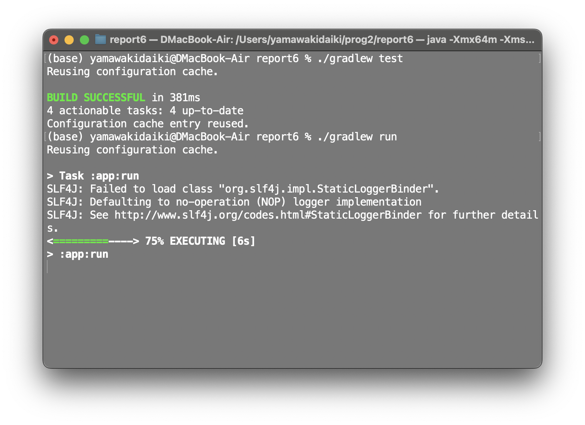
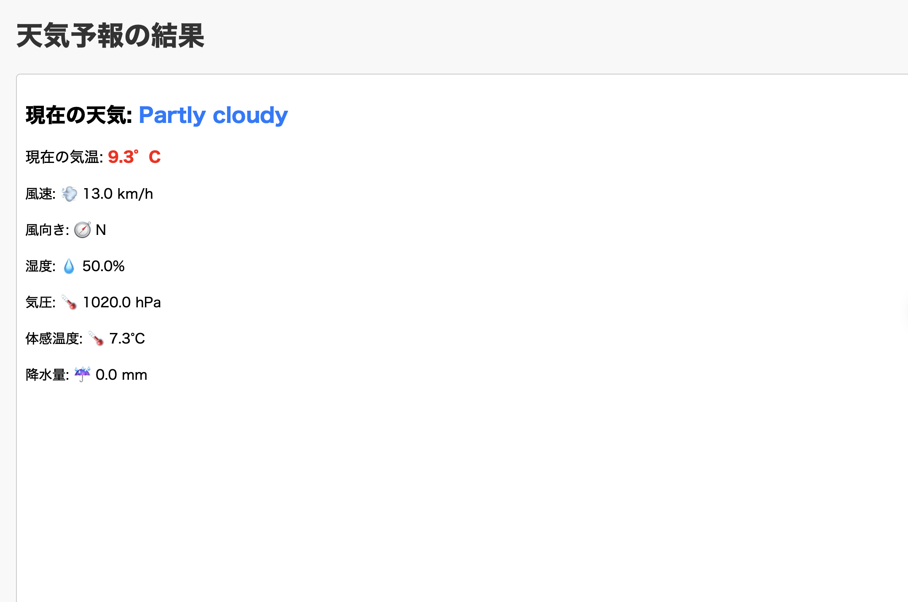

# 課題レポート6: Java最終課題（天気予報アプリ）
235221E 山脇大輝

## 課題説明
入力された都市名に対する現在の天気情報をリアルタイムに取得し，わかりやすい形で提示する仕組みを作る。ユーザインタフェース部分には軽量フレームワークSparkを用いてWebアプリケーションを実装した。単体テストにはJUnitを用い，天気情報解析処理の信頼性を担保している。
ユーザが都市名を入力すると，Weather APIにアクセスして当該都市の現在の天気情報を取得し，ブラウザ上に可視化するWebアプリケーションの構築を行う。入力フォームを通して得られる都市名を引数として，WeatherSolverクラスが天気情報のJSONを取得・解析し，見やすい形に整形してユーザーに提供するようなJavaのプログラムを実装した。なお，軽量フレームワークであるSparkを用いることで，HTTPサーバ機能の設定を簡略化している。ユーザーへ表示する内容としては，天気情報にアイコンを追加し視覚的に理解しやすいUIを追求した。

## GitHubリポジトリURL
[GitHubリポジトリリンク](https://github.com/yamawakidaiki/report6.git "github.com")
<!--
https://github.com/yamawakidaiki/report6.git
-->


## 要件定義
Sparkを用いた天気予報Webアプリの開発を行った。ユーザが任意の都市名を入力すると，Weather APIから現在の天気情報を取得し，HTML形式でブラウザ上に表示するシステムを開発した。本システムの要件は以下のとおりである。

1. **天気情報取得機能**  
   Weather APIを用いて，ユーザが指定した都市名に対応する最新の天気データを取得する機能を提供する。
2. **データ解析機能**  
   取得したJSON形式の天気データを解析し，気温や風速などの主要項目を抽出する機能を提供する。
3. **Web上での表示**  
   解析済みの天気情報をHTMLで整形し，ブラウザ上で気温・風速・天気・風向などを閲覧できるようにする。
4. **ユーザ入力**  
   ブラウザ上にフォームを設けることにより，ユーザが都市名を指定し，見たい天気を見れるようにした。なお，HTML・CSSを適用し，風速等の情報に対応したアイコンを表示させた。
   

---

## 取り組み方
単独で開発を行った。まず，自分自身で実装しトラブルが発生した場合にインターネット・生成AIを活用してエラー解消を行った。なお，提案されたコードは動作原理を理解し，期待される挙動の検証を行った上で実装を進めた。特にエラー対応・リファクタリング・開発工程を詳細にし，次段階の実装内容の明確化の点で生成AIを活用した。


## クラス設計
- **WeatherSolverクラス**  
  - 役割: Weather APIへのアクセス，取得データの解析，HTML生成 
  - フィールド:  
    - `apiKey`: 天気情報APIのキー。Weather APIを呼び出す際に必要となる。
  - メソッド:  
    1. `fetchWeatherData(String cityName)`: 指定された都市名に対する天気データを取得する（APIへ問い合わせを行い，JSON形式の結果を取得する）  
    2. `parseWeatherData(String jsonData)`: 取得したJSONを解析し，必要な項目(気温，風速など)を取り出してHTML断片を生成する  
    3. `generateWeatherPage(String jsonData)`: ページ全体をHTML形式に組み立てる  

- **Mainクラス**  
  - 役割: エントリポイントとして，サーバーの起動・やルーティングを行う。  
  - フィールド: 特になし  
  - メソッド:  
    - `main(String[] args)`: mainメソッドのみ配置し，Sparkサーバ起動やルーティングの定義を行う  

- **WeatherSolverTestクラス**  
  - 役割: WeatherSolverに対する単体テストを行い，JSON解析やHTML生成機能が正しく動作するかを検証する。  
  - メソッド(テスト):  
    1. `testParseWeatherData()`: `parseWeatherData()`の出力を確認する  
    2. `testGenerateWeatherPage()`: ページ全体のHTMLが意図した形式となるかを確認する  

メイン処理(Mainクラス)がWeatherSolverを呼び出し，ユーザからのリクエストに応じてHTMLを返す。一方，WeatherSolverTestはユニットテストとして，WeatherSolver内部の処理が正しいかどうかを検証する。


## クラス図・シーケンス図

下記にクラス図およびシーケンス図を示す。


続いて，シーケンス図では，ユーザが都市名を入力してから天気情報がブラウザに返されるまでの流れを示す。

---
## コードの解説
WeatherSolverクラスが天気情報取得・解析・HTML整形といった主要なロジックを担っている。
その中でも以下の2メソッドは「JSON解析」と「最終的なページ構築」という要の処理であり，動作不備があればユーザには誤った気象データや不完全なHTMLが表示されることになるため，parseWeatherData(String jsonData) とgenerateWeatherPage(String jsonData) の解説を行う。
以下に，2つの主要メソッドを示し，解説を行う。

### code1.  parseWeatherData(String jsonData) の解説

```java
/**
 * JSON文字列を解析し，天気情報のHTML断片を生成するメソッド.
 * @param jsonData 天気APIから取得したJSON文字列
 * @return 天気情報を表示するためのHTML断片
 */
public String parseWeatherData(String jsonData) {
    // JSONパース
    JsonObject jsonObject = JsonParser.parseString(jsonData).getAsJsonObject();
    JsonObject current = jsonObject.getAsJsonObject("current");
    JsonObject condition = current.getAsJsonObject("condition");

    double temperature = current.get("temp_c").getAsDouble();
    String weatherCondition = condition.get("text").getAsString();
    // ...省略(風速等の取得処理)...

    // 取得データをHTMLタグで整形し，必要なクラス名を付与して返却
    return String.format(
        "<div class='weather-info'>"
            + "<h2>現在の天気: <span class='weather-condition'>%s</span></h2>"
            + "<p class='temperature'>現在の気温: %.1f°C</p>"
            + "..."
            + "</div>",
        weatherCondition, temperature
    );
}

```

このメソッドはJSON解析とHTML断片生成の両方を行う。

- JSON解析: Gsonライブラリを用い，jsonDataからtemp_cなど必要な気象情報を抽出。
- HTML断片生成: テンプレート文字列(上記String.format等)を用いて取得結果をHTMLタグに組み込む。アイコン表示や色付けに関わるクラス名(.weather-infoなど)もここで指定し，後続のCSSにより視覚的にわかりやすく表示されるようにしている。
注意点として，JSONに含まれる要素名（例: "temp_c", "wind_dir"など）が変更されると，本メソッドも修正する必要がある。

### code2.  generateWeatherPage(String jsonData) の解説
```java

/**
 * JSON文字列を受け取り，HTMLページ全体を生成するメソッド.
 * @param jsonData 天気APIから取得したJSON文字列
 * @return 完全なHTMLページ
 */
public String generateWeatherPage(String jsonData) {
    // まずparseWeatherData()で本体(天気情報の断片)を取得
    String weatherBody = parseWeatherData(jsonData);

    // HTMLドキュメントとして整形し，CSS等を読み込む<head>を付与
    return String.format(
        "<!DOCTYPE html>"
        + "<html lang='ja'>"
        + "<head>"
        + "  <meta charset='UTF-8'>"
        + "  <link rel='stylesheet' href='/css/style.css'>"
        + "</head>"
        + "<body>"
        + "  <h1>天気予報の結果</h1>"
        + "  %s"
        + "</body>"
        + "</html>",
        weatherBody
    );
}
```
parseWeatherData()で生成した「天気情報データ」を，最終的にひとつのHTMLページとしてまとめ上げる。

- <head> タグにてCSSファイルをリンクし，全体のデザインを適用。
-  <body> 部分にweatherBody(解析結果のHTML断片)を挿入し，ユーザがブラウザ上で結果を一目で確認できる構造を作る。
なお，レスポンスとしてこのページ全体の文字列を返すため，ブラウザはあたかも1つの静的HTMLファイルを受け取ったように表示される。


## テスト結果・実行結果
### テスト結果
JUnitを用いて実行したテスト結果を以下の図に示す。


### 実行結果
コンソール上で./gradlew runを実行し，ブラウザからhttp://localhost:4567へアクセスすることで天気を閲覧できる。都市名を入力すると，気温や風向きなどがHTML形式で表示され，アイコン(絵文字)が表示される。





## 考察
KISS原則に則ったコーディングを心掛けたものの，開発時間が進むにつれ，コードを書くこと自体が目的化してしまい，結果としてコードの複雑化を招いてしまった。その際，ChatGPTにコードの修正や解説を求めるような状態が多く発生した。また，ソースコード管理においても，Githubへのpushの回数が少なかったため，コードの誤りを修正したい局面で必要なバージョンを取得できない状況が頻繁に生じていた。より沢山pushを行ってログを蓄積することは，開発効率向上のみならず，トータルの作業時間を短縮できる可能性がある。

以上の反省点を踏まえ，改めて同じ課題に取り組むならば，まず機能単位のスケジュールを明確化し，一つひとつ確認するのがよい。
一つ一つの項目をクリアするためにコードを書くことによって，コードの複雑化防止・円滑なコーディングを目指す。実装したい機能を一番最初に考え，そこから逆算してやるべき課題を列挙していく。以下に示すように段階的計画を設定する。


1.	仮のJSONデータを用いた表示機能の確認
2.	Weather APIとの通信部分の実装とテスト
3.	JSONパースのエラー処理および例外ハンドリングの強化
4.	ユーザインタフェース(UI)の改良とアイコン表示の強化
5.	追加機能（週間天気やグラフ表示など）の組み込み
6.	ユニットテストの拡充とリファクタリング

このアプローチにより，開発途中での不具合がどの段階で生じたかを特定しやすくなり，効率的なコーディングが可能となると考えられる。また，ソースコード管理ではGitHubを積極的に活用し，タスクを可視化しながら段階的に達成していくことで進捗管理を円滑に進められる。こうした取り組みにより，機能追加を円滑に進め，より完成度の高い天気予報アプリに育てられると想定される。
